试试[MI2-Utilities](https://github.com/BlackDeluxeCat/MI2-Utilities-Java/)!

Miner的Mindustry群:757679470

---

# 功能

---

## UI
1. MinerToolsTable
   * 队伍信息
     * 队伍玩家数量(Tooltip显示基础队伍规则)
     * 队伍单位显示
     * 队伍全局电量(Tooltip显示详细电量情况)

       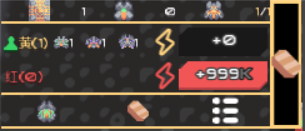

   * 一些有用的按钮
     * 暂停建造(**仅手机**)
     * 自动升级传送带
     * 重建方块
     * 快捷投降

       

   * 换队/跳波器

     

   * 玩家列表
     * 所有玩家的名字
     * 可锁定玩家视角(锁定的玩家控制炮塔时,会自动调整视角)
     * 可切换到玩家视角
     * 可一键投票踢出玩家
     
     

   * 快捷蓝图

     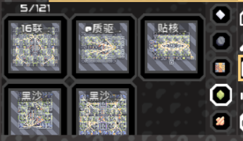

   * 玩家AI
     * 挖矿AI
     * 跟随AI

3. 聊天记录
   * 查询历史聊天记录
   * 可以复制聊天记录(电脑:Ctrl+单击)

4. 更好的**核心资源显示**
   * 单位数量显示
   * 物品每秒变化量显示
   * 玩家预建消耗显示
   * 可自定义的ui列数

   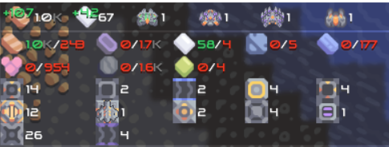

5. 更好的**信息面板**
   * **单位,建筑,地板信息一起显示!**
   * 单位
     * 武器冷却状态
   * 建筑
     * 物品详情
   * 地板
     * 显示更详尽
   
   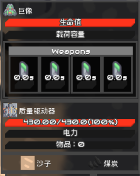

---

## 画面
* 建筑
  * 选中
    * 异队选中信息

      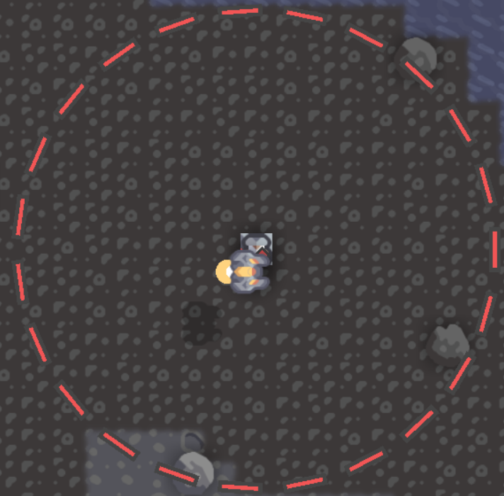

    * 桥带连接详情

      

  * 建筑血条
  * 异队方块状态

    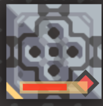

  * 构造方块耗材信息

    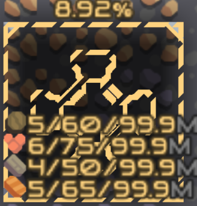

  * 附近炮塔警戒
  * 物品炮塔子弹类型显示

    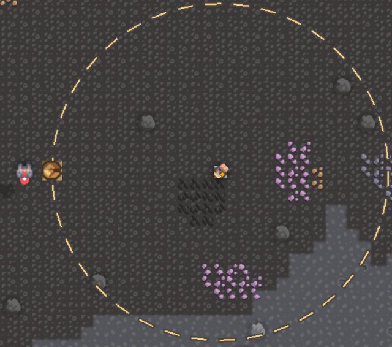

  * 单位工厂进度条

    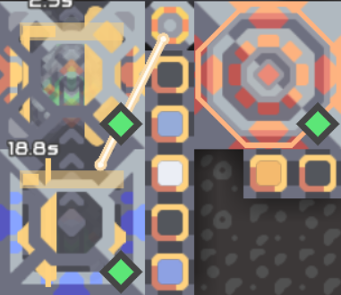
  
  * 显示超速区域
  
    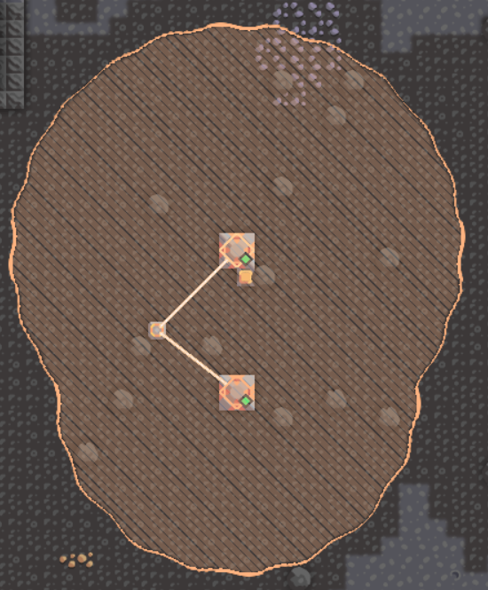

  * 单位
    * 单位指示器(核心危险警告)

      

    * 附近单位警戒

      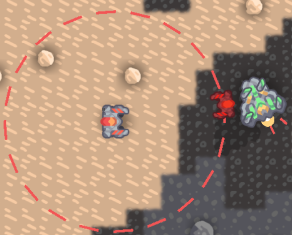

    * 单位信息条
      * 血条
      * 立场回复条
      * 单位状态条
      * 荷载条

      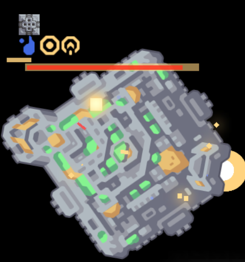

  * 玩家 
    * 荷载拾放提示
  
      
  
    * 玩家范围显示
  
      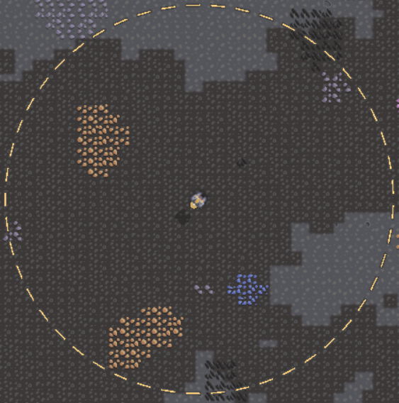
    
---

## 其他小功能
* 进入游戏后,显示被ban的单位或方块
* UIScale的step修改
* 物品桥带可拿取物品
* 更多方块信息条
  * 血条: 血量显示更详细
  * 进度条: 进度显示更详细

---

# 其他
Mod的**90%功能**均可在**设置**中**打开或关闭**
