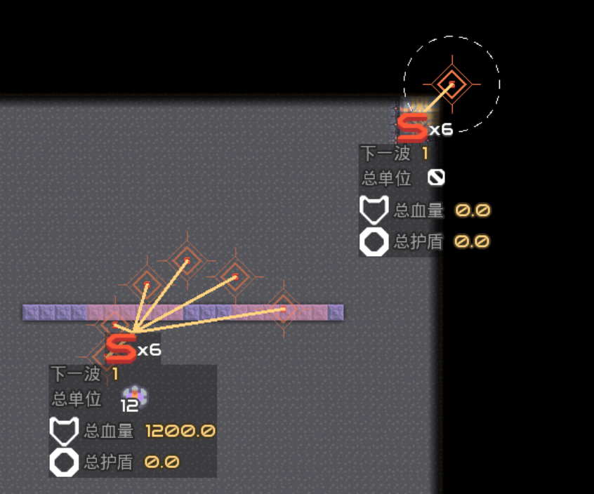

Mod功能区
===========================

    说明的上次更新时间：2024/02/09，仅供参考，具体功能看最新版

# UI

## 工具箱

* 队伍信息
* 队伍玩家数量(Tooltip显示基础队伍规则)
* 队伍单位显示
* 队伍全局电量

   

* 玩家列表
    * 所有玩家的名字
    * 可锁定玩家视角(锁定的玩家控制炮塔时,会自动调整视角)
    * 可切换到玩家视角
    * 可一键投票踢出玩家

* 玩家AI
    * 挖矿AI
    * 跟随AI

3. 聊天记录
    * 查询历史聊天记录
    * 可以复制聊天记录(电脑:Ctrl+单击)

      

4. 更好的**核心资源显示**
    * 单位数量显示
    * 物品每秒变化量显示
    * 玩家预建消耗显示
    * 可自定义的ui列数

      

5. 更好的**信息面板**
    * **单位,建筑,地板信息一起显示!**
    * 单位
        * 武器冷却状态
    * 建筑
        * 物品详情
    * 地板
        * 显示更详尽

   

---

## 画面

* 建筑
    * 选中
        * 异队选中信息

          

        * 桥带连接详情

          

    * 建筑血条
    * 异队方块状态

      

    * 构造方块耗材信息

      

    * 附近炮塔警戒
    * 物品炮塔子弹类型显示

      

    * 单位工厂进度条

      

    * 显示超速区域

      

    * 单位
        * 单位指示器(核心危险警告)

          

        * 附近单位警戒

          

        * 单位信息条
            * 血条
            * 立场回复条
            * 单位状态条
            * 荷载条

          

    * 玩家
        * 荷载拾放提示

          

        * 玩家范围显示

          

---

## 其他小功能

* 物品桥带可拿取物品
* 更多方块信息条
    * 血条: 血量显示更详细
    * 进度条: 进度显示更详细
* 出怪点显示
  

---

Mod 90%的功能支持游戏内开关

试试[MI2-Utilities](https://github.com/BlackDeluxeCat/MI2-Utilities-Java/)!